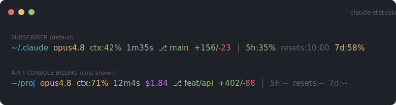

# claude-statusline

[](https://github.com/ZGhey/claude-statusline/actions/workflows/shellcheck.yml)

[English](README.md) · **简体中文**

一个轻量、几乎零依赖的 [Claude Code](https://code.claude.com) 状态栏。
单个 POSIX `sh` 脚本,无需 Node、无后台进程 —— 只用到 `jq` 和 `awk`。



## 显示内容

**左组(活跃信息):**

| 字段 | 示例 | 含义 |
|------|------|------|
| 目录 | `~/.claude` | 当前工作目录(青色,`~` 缩写) |
| 模型 | `opus4.8` | 当前模型,短名形式 |
| 上下文 | `ctx:42%` | 上下文窗口用量 —— 绿 / 黄(≥50%) / 红(>80%) |
| 时长 | `1m35s` | 本次 session 的实际耗时 |
| 成本 | `$1.84` | 本次 session 成本(USD)—— **仅在 API/console 计费时显示**,订阅用户隐藏(见下文) |
| 分支 | `main` | Git 分支 |
| 增删行 | `+156/-23` | 本次 session 中 Claude 改动的新增/删除行数 |

**右组(暗色,限额):**

| 字段 | 示例 | 含义 |
|------|------|------|
| 5h | `5h:35%` | 5 小时限额用量 —— 绿 / 黄(≥50%) / 红(>80%) |
| 重置 | `resets:10:00` | 5 小时窗口的重置时间(近期、可操作的那个) |
| 7d | `7d:58%` | 7 天(周)限额用量,颜色阈值相同 —— 放在最后,因为时效性最弱 |

数据不可用时各字段会自动隐藏,保持状态栏整洁。

## 成本与订阅

`cost.total_cost_usd` 是一个**客户端估算值**,按 Claude Code 官方文档说法
"可能与你的实际账单不同"。对 Claude.ai 的 **Pro/Max 订阅用户**而言,它只是一个
"折算成 API 大概要花多少"的数字 —— 你付的是固定订阅费,而非按 token 计费 ——
所以显示它反而有误导性。

状态栏的 JSON 里没有任何计费模式字段,但 `rate_limits` 这个块**只对订阅用户出现**。
脚本就用它作为判定信号:

- **订阅用户**(存在 `rate_limits`)→ 成本**隐藏**
- **API / console 计费**(无 `rate_limits`)→ 成本**显示**(那是你真实的账单)

如需无视判定强制显示成本,设置环境变量:

```sh
export STATUSLINE_SHOW_COST=1
```

## 安装

```sh
git clone https://github.com/ZGhey/claude-statusline.git
cd claude-statusline
./install.sh
```

安装脚本会把 `statusline-command.sh` 复制到 `~/.claude/`,并在
`~/.claude/settings.json` 的 `statusLine` 键下注册它(采用**合并**写入,
你已有的其它配置会被保留)。开一个新 session 即可看到。

> 如果你的 Claude 配置放在别处,脚本会尊重 `$CLAUDE_CONFIG_DIR`。

### 手动安装

如果不想跑脚本,把 `statusline-command.sh` 放到任意位置,然后在
`~/.claude/settings.json` 中加入:

```json
{
  "statusLine": {
    "type": "command",
    "command": "sh /absolute/path/to/statusline-command.sh"
  }
}
```

## 依赖

- `jq` —— 解析 Claude Code 通过 stdin 传入的状态 JSON
- `awk` —— 成本字段的浮点运算

两者在 macOS 和大多数 Linux 发行版上都自带。macOS 上若缺 `jq`:
`brew install jq`。

## 自定义

所有逻辑都在 `statusline-command.sh` 里。颜色是文件顶部定义的 ANSI 转义,
每个字段都是一小段清晰编号的代码块,可自由重排或删除。

**想用 git 工作区 diff 而不是 Claude 的 session 行数?** 把第 7 段里对
`total_lines_added/removed` 的读取替换成 `git -C "$current_dir" diff --shortstat`
调用即可。(默认用 JSON 里的值,零子进程开销。)

## 许可证

MIT
